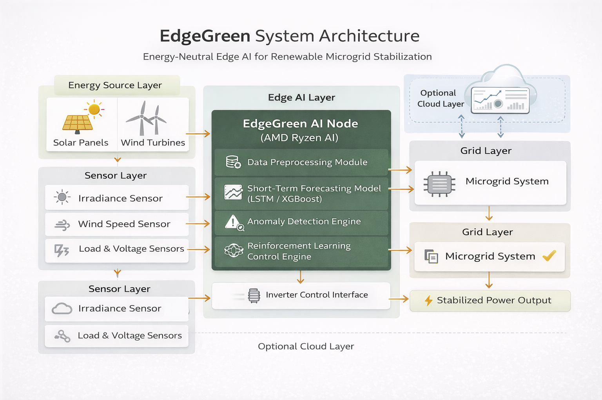

# 🌿 EdgeGreen – Energy-Neutral Edge AI for Microgrid Stabilization

EdgeGreen is an AI-powered edge computing prototype designed to stabilize renewable microgrids in real-time using low-power inference.

Built for AMD Slingshot Hackathon – Sustainable AI & Green Tech Theme.

---

## 🚀 Problem Statement

Renewable energy sources like solar are highly unstable due to:

- Cloud cover fluctuations
- Sudden irradiance drops
- Peak load imbalances
- Energy overproduction waste

Traditional monitoring systems react **after instability occurs**.

EdgeGreen predicts instability before it happens and triggers adaptive stabilization.

---

## 🧠 Solution Overview

EdgeGreen performs:

- Real-time irradiance simulation
- 30-second ahead solar forecasting
- Anomaly detection (cloud cover drops)
- Grid stability scoring
- Intelligent stabilization trigger logic

All designed for **low-power edge deployment**.

---

## 📊 Features

- Live solar telemetry visualization
- Time-series forecasting (Next 30 seconds)
- Anomaly detection engine
- Dynamic stability score
- Explicit stabilization trigger alerts
- Edge AI mode simulation

---

## 🏗 Architecture

(Add your architecture image here after uploading)

---

## 🛠 Tech Stack

- Python
- Streamlit
- NumPy
- Pandas
- Scikit-learn
- Matplotlib

---

## ▶ How to Run

```bash
git clone https://github.com/AKHILKUMAR9k/Edgegreen.git
cd Edgegreen
pip install -r requirements.txt
streamlit run app.py


🎯 AMD Alignment

Designed for deployment on:

AMD Ryzen AI processors

Low-power edge inference systems

Sustainable compute environments

EdgeGreen minimizes cloud dependency and reduces compute carbon footprint.

👨‍💻 Author

Puli Akhil Kumar
B.Tech CSE (Data Science)


---

## 🏗 Architecture



---

## 📌 Hackathon Submission

Theme: Sustainable AI & Green Tech  
Prototype Status: Working  

Demo Video: (Will be added after upload)

---
